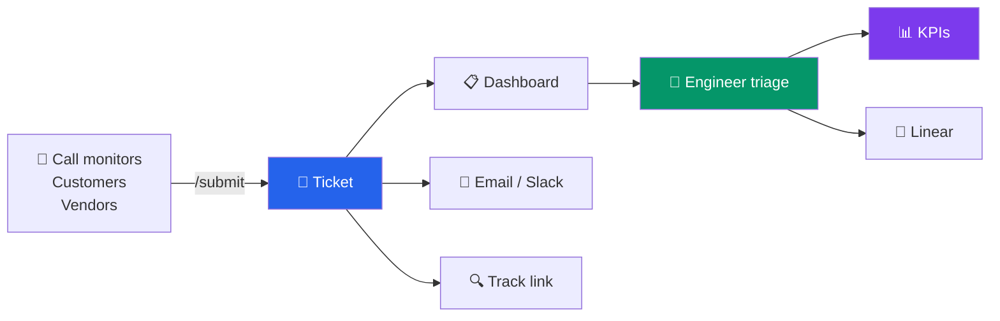
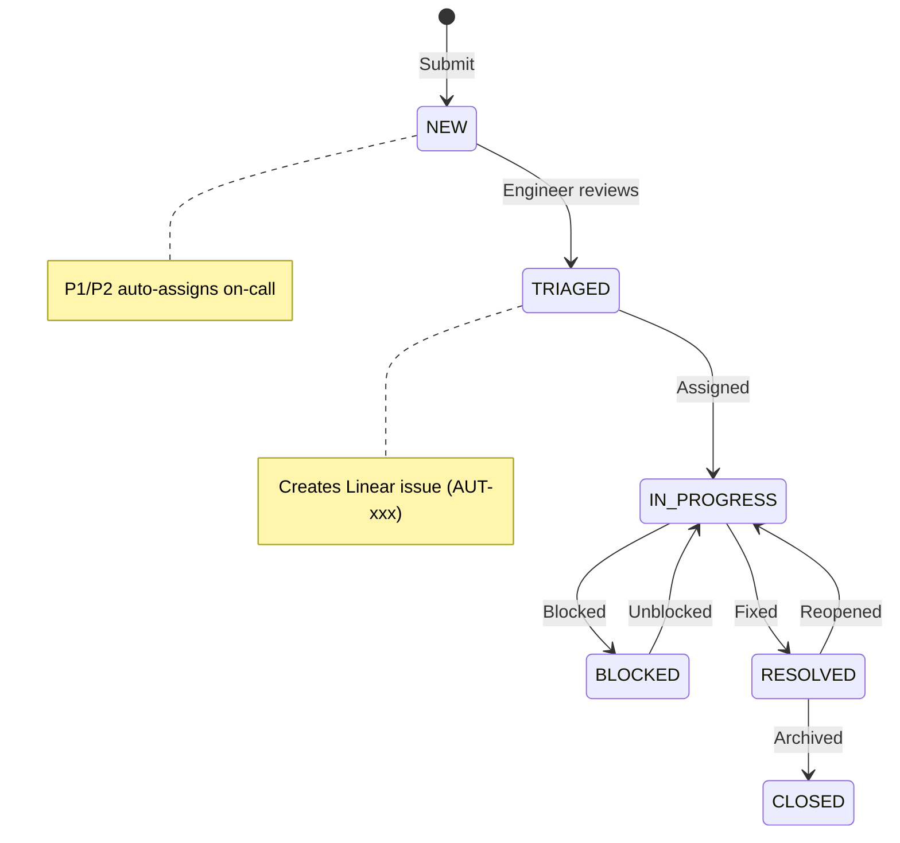
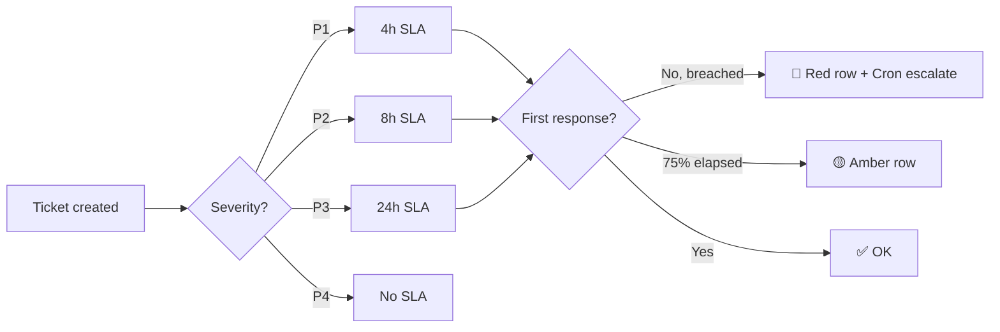
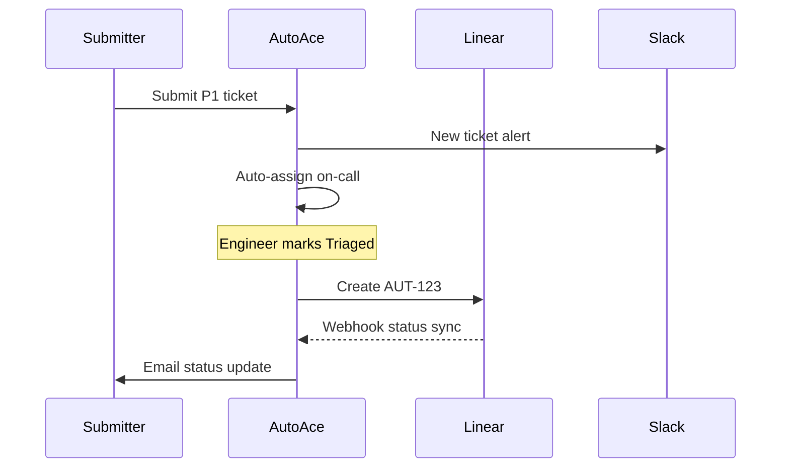
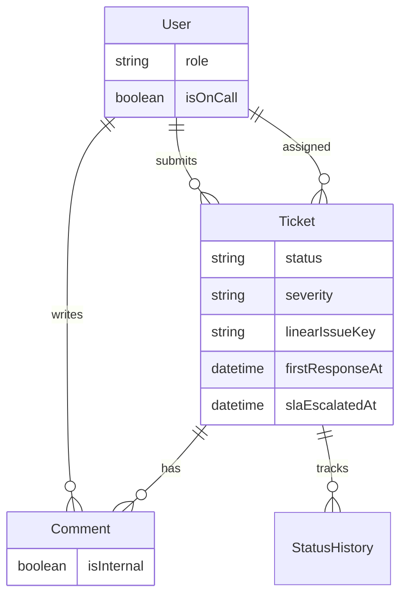
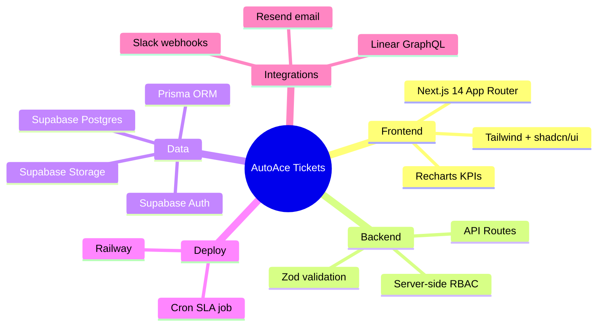
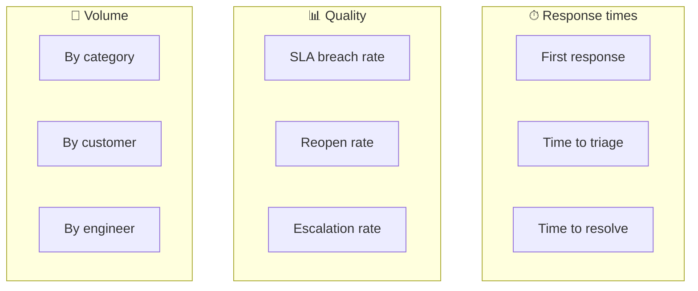

<p align="center">
  
</p>

<h1 align="center">AutoAce Tickets</h1>

<p align="center">
  <strong>Internal ticketing for engineering escalations</strong><br/>
  Non-technical users submit → Engineering triages → KPIs & automations keep ops moving
</p>

<p align="center">
  
  
  
  
  
</p>

---

## What it does



| Problem | Solution |
|---------|----------|
| Non-technical users can't use Linear | Public `/submit` — no login required |
| Engineering needs structure | Dashboard, assign, status, internal notes |
| Urgent issues get lost | P1/P2 → on-call auto-assign + SLA alerts |
| Management needs visibility | `/kpi` dashboard with 9 core metrics |

---

## Ticket lifecycle

<p align="center">
  
</p>



---

## App map

<p align="center">
  
</p>

## Who sees what

<p align="center">
  
</p>

| Page | Public | Submitter | Operator | Engineer | Admin |
|------|:------:|:---------:|:--------:|:--------:|:-----:|
| `/submit` | ✅ | ✅ | ✅ | ✅ | ✅ |
| `/track/[token]` | ✅ | — | — | — | — |
| `/my-tickets` | — | ✅ | ✅ | ✅ | ✅ |
| `/dashboard` | — | — | 👁️ read-only | ✅ | ✅ |
| `/tickets/[id]` | — | own only | 👁️ | ✅ | ✅ |
| `/kpi` | — | — | — | ✅ | ✅ |
| `/admin/users` | — | — | — | — | ✅ |

---

## SLA at a glance



| Severity | Response SLA | Dashboard |
|----------|-------------|-----------|
| 🔴 P1 | 4 hours | Red row when breached |
| 🟠 P2 | 8 hours | Amber at 75% |
| 🟡 P3 | 24 hours | Cron auto-escalates |
| ⚪ P4 | None | — |

---

## Integrations

<p align="center">
  
</p>



All integrations are **optional** — enable with env vars. Details → [docs/DEPLOY.md](docs/DEPLOY.md)

---

## Data model



---

## Tech stack



---

## Quick start

```bash
git clone <repo>
cd autoace-tickets
cp .env.local.example .env.local   # fill Supabase keys
npm install
npx prisma migrate dev && npx prisma db seed
npm run dev
```

→ **http://localhost:3000** · Public submit at **/submit**

**Production deploy** → see [docs/DEPLOY.md](docs/DEPLOY.md) (Railway + env vars + one-time setup)

---

## Demo logins

| Role | Email | Password |
|------|-------|----------|
| Admin | `admin@autoace.com` | `Password123!` |
| Engineer | `engineer1@autoace.com` | `Password123!` |
| Operator | `operator1@autoace.com` | `Password123!` |
| Submitter | `submitter1@autoace.com` | `Password123!` |

> Create matching users in **Supabase Auth**, then link `supabaseId` in SQL. See [docs/DEPLOY.md](docs/DEPLOY.md).

---

## KPI dashboard

Nine metrics from the project scope — all live on `/kpi`:



---

## Project structure

```
autoace-tickets/
├── app/
│   ├── (public)/submit, login, track   ← no auth
│   ├── (app)/dashboard, kpi, admin     ← authenticated
│   └── api/                            ← REST + webhooks + cron
├── components/                         ← UI + charts
├── lib/                                ← auth, sla, linear, email, slack
├── prisma/                             ← schema + migrations + seed
└── docs/
    ├── DEPLOY.md                       ← full setup guide
    └── assets/*.svg                    ← architecture diagrams
```

---

## What's next

| Priority | Feature |
|----------|---------|
| 🔥 High | AI severity suggestion · Recurring issue detection · Filtered CSV export |
| 📌 Medium | SMS (Twilio) · Call platform webhook · Weekly digest email |
| 🔮 Later | MCP tools for engineers · Configurable SLA UI · Password reset |

---

## Key decisions

| Decision | Why |
|----------|-----|
| Anonymous submit | Zero friction for non-technical users |
| Token tracking `/track/[token]` | Customers see status, not internal notes |
| Linear only after triage | Engineering controls what enters their backlog |
| Server-side RBAC | UI hides buttons; API enforces security |
| Operator = read-only | Call monitors see everything, change nothing |

---

<p align="center">
  <sub>Built for AutoAce · <a href="docs/DEPLOY.md">Deploy guide</a> · <a href="/submit">Try /submit</a></sub>
</p>
