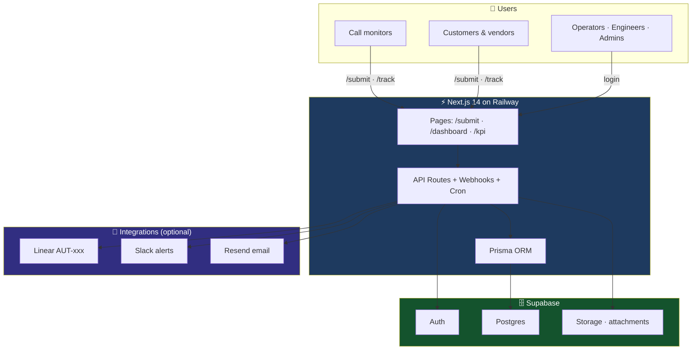
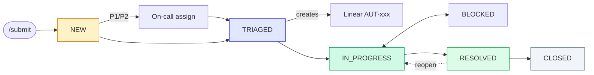
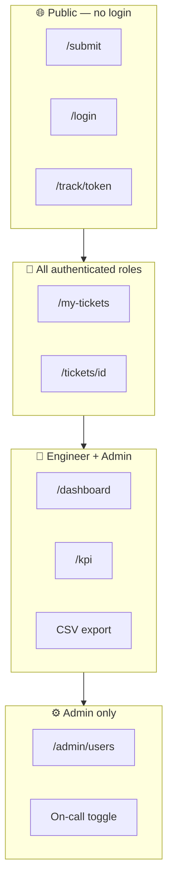
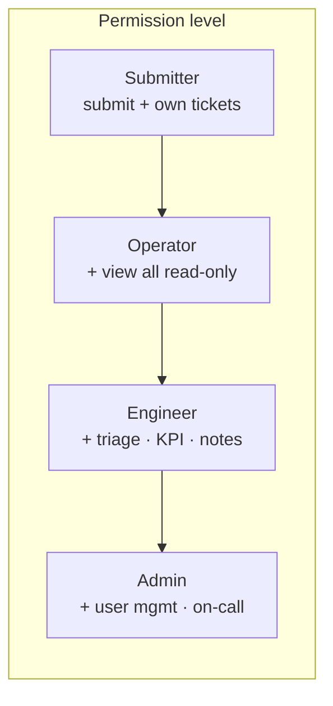
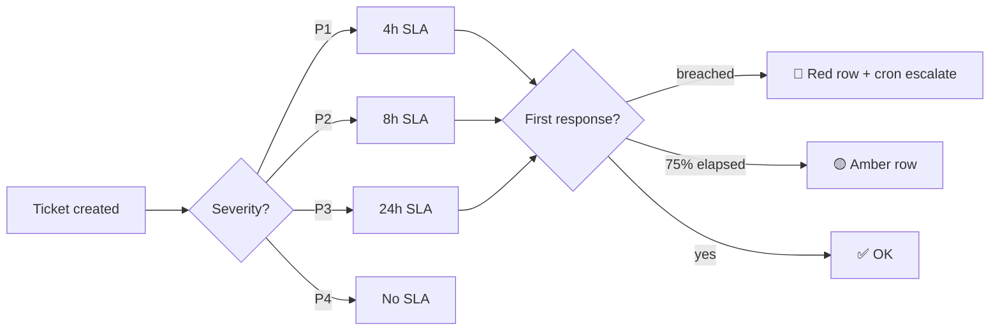
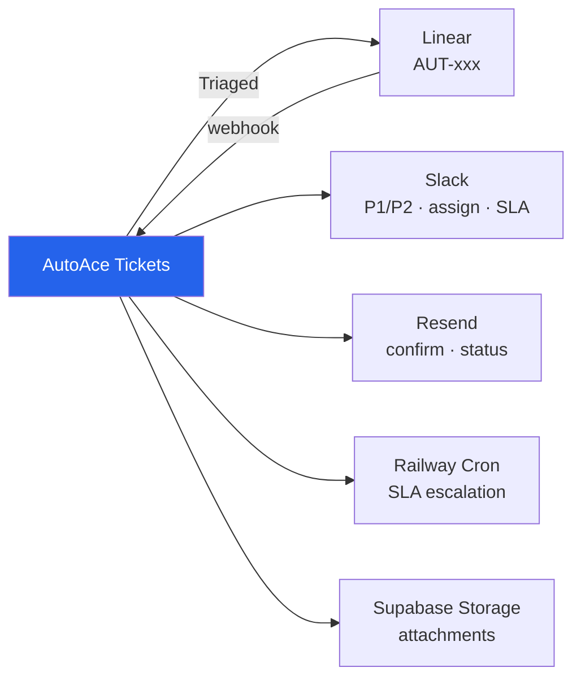
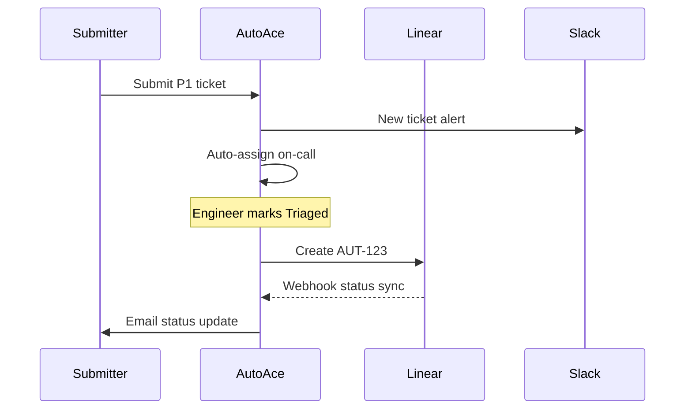
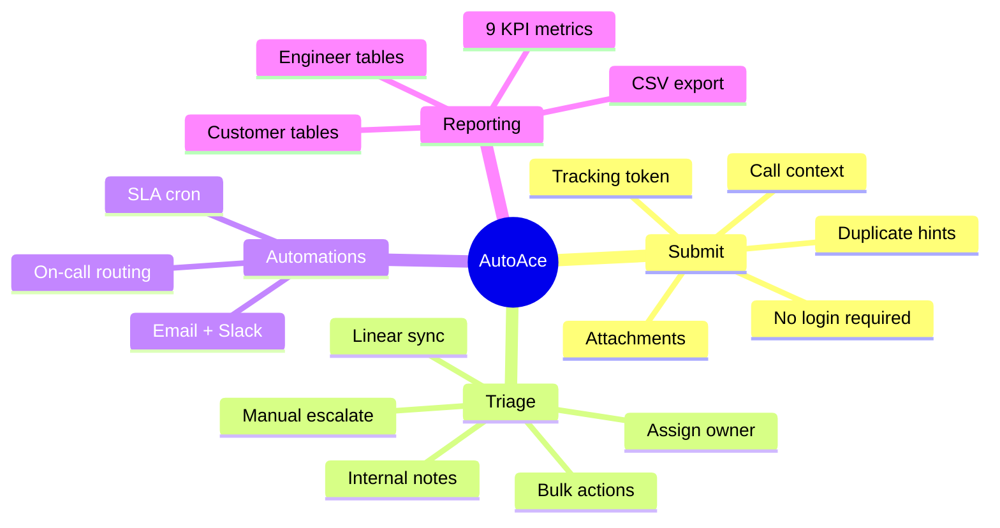
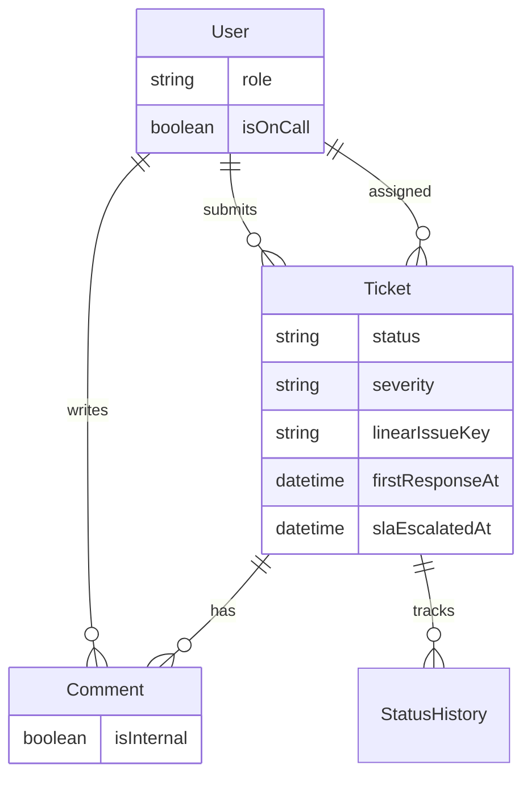
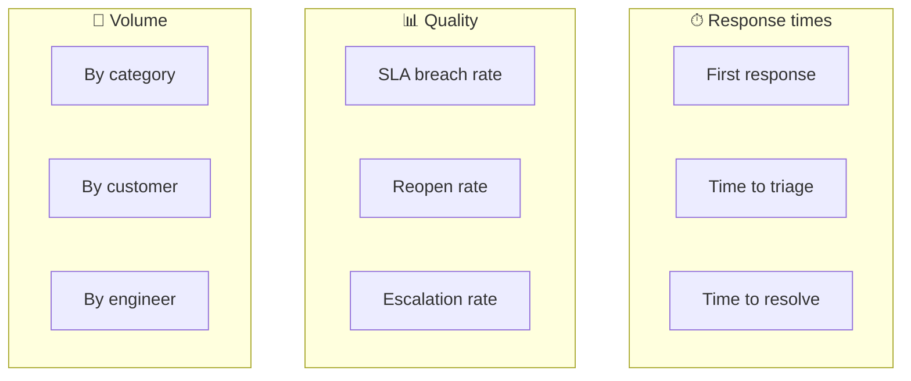

<h1 align="center">AutoAce Tickets</h1>

<p align="center">
  <strong>Internal ticketing for engineering escalations</strong><br/>
  Non-technical users submit → Engineering triages → KPIs & automations keep ops moving
</p>

<p align="center">
  
  
  
  
  
  
</p>

<p align="center">
  <a href="https://join.slack.com/t/autoaceticket-vts9935/shared_invite/zt-41t6ctnmr-3nFERfqFdNBnHrSzwFUQoA"><strong>Join Slack workspace →</strong></a>
  &nbsp;·&nbsp;
  <a href="docs/DEPLOY.md">Deploy guide</a>
  &nbsp;·&nbsp;
  <a href="https://github.com/SandaAbhishekSagar/autoace-internal-ticketing-dashboard">GitHub</a>
</p>

---

## Architecture



| Problem | Solution |
|---------|----------|
| Non-technical users can't use Linear | Public `/submit` — no login required |
| Engineering needs structure | Dashboard, assign, status, internal notes |
| Urgent issues get lost | P1/P2 → on-call auto-assign + SLA alerts |
| Management needs visibility | `/kpi` dashboard with 9 core metrics |

---

## Ticket lifecycle



| Status | Meaning |
|--------|---------|
| **NEW** | Just submitted · P1/P2 auto-routes to on-call |
| **TRIAGED** | Reviewed · Linear issue created |
| **IN_PROGRESS** | Engineer actively working |
| **BLOCKED** | Waiting on dependency |
| **RESOLVED** | Fix deployed · submitter notified |
| **CLOSED** | Archived |

---

## App map & roles



| Page | Public | Submitter | Operator | Engineer | Admin |
|------|:------:|:---------:|:--------:|:--------:|:-----:|
| `/submit` | ✅ | ✅ | ✅ | ✅ | ✅ |
| `/track/[token]` | ✅ | — | — | — | — |
| `/my-tickets` | — | ✅ | ✅ | ✅ | ✅ |
| `/dashboard` | — | — | 👁️ read-only | ✅ | ✅ |
| `/tickets/[id]` | — | own only | 👁️ | ✅ | ✅ |
| `/kpi` | — | — | — | ✅ | ✅ |
| `/admin/users` | — | — | — | — | ✅ |



---

## SLA at a glance



| Severity | Response SLA | Dashboard |
|----------|-------------|-----------|
| 🔴 P1 | 4 hours | Red row when breached |
| 🟠 P2 | 8 hours | Amber at 75% |
| 🟡 P3 | 24 hours | Cron auto-escalates |
| ⚪ P4 | None | — |

---

## Integrations





| Integration | Env var | Trigger |
|-------------|---------|---------|
| **Slack** | `SLACK_WEBHOOK_URL` | New P1/P2, assign, SLA breach, escalate |
| **Email** | `RESEND_API_KEY` | Confirm, status change, assignment |
| **Linear** | `LINEAR_API_KEY` + `LINEAR_TEAM_ID=AUT` | Status → Triaged |
| **Linear webhook** | `LINEAR_WEBHOOK_SECRET` | Status sync back |
| **SLA cron** | `CRON_SECRET` | Every 30 min via Railway |

**Slack workspace:** [Join AutoAce Ticket Slack](https://join.slack.com/t/autoaceticket-vts9935/shared_invite/zt-41t6ctnmr-3nFERfqFdNBnHrSzwFUQoA)

Full setup → [docs/DEPLOY.md](docs/DEPLOY.md)

---

## Features



---

## Data model



---

## Tech stack

| Layer | Tools |
|-------|-------|
| Frontend | Next.js 14 · Tailwind · shadcn/ui · Recharts |
| Backend | API Routes · Zod · server-side RBAC |
| Data | Supabase Postgres · Prisma · Supabase Auth · Storage |
| Deploy | Railway · Prisma migrate on start |
| Integrations | Linear GraphQL · Slack webhooks · Resend |

---

## Quick start

```bash
git clone https://github.com/SandaAbhishekSagar/autoace-internal-ticketing-dashboard.git
cd autoace-tickets
cp .env.local.example .env.local   # fill Supabase keys
npm install
npx prisma migrate dev && npx prisma db seed
npm run dev
```

→ **http://localhost:3000** · Public submit at **/submit**

**Production** → [docs/DEPLOY.md](docs/DEPLOY.md)

---

## Demo logins

| Role | Email | Password |
|------|-------|----------|
| Admin | `sabhisheksagar200@gmail.com` | `$uper!@#$base` |
| Engineer | `bob@gmail.com` | `TempPassp9fkj2y8!` |
| Operator | `frank@gmail.com` | `TempPassv0c76vwp!` |
| Submitter | `abhisheksagar110@gmail.com` | `TempPasskbzvup36!` |

> Link Supabase Auth users to DB: `UPDATE "User" SET "supabaseId" = '<uuid>' WHERE email = '...'` — see [docs/DEPLOY.md](docs/DEPLOY.md)

---

## KPI dashboard (`/kpi`)



---

## Project structure

```
autoace-tickets/
├── app/(public)/     submit · login · track
├── app/(app)/        dashboard · kpi · admin · tickets
├── app/api/          REST · webhooks · cron
├── components/       UI + charts
├── lib/              auth · sla · linear · email · slack
├── prisma/           schema · migrations · seed
└── docs/DEPLOY.md    full setup guide
```

---

## Key decisions

| Decision | Why |
|----------|-----|
| Anonymous submit | Zero friction for non-technical users |
| Token tracking `/track/[token]` | Customers see status, not internal notes |
| Linear only after triage | Engineering controls their backlog |
| Server-side RBAC | API enforces security, not just UI |
| Operator = read-only | Call monitors see all, change nothing |

---

## What's next

| Priority | Feature |
|----------|---------|
| 🔥 High | AI severity suggestion · Recurring issue detection · Filtered CSV export |
| 📌 Medium | SMS (Twilio) · Call platform webhook · Weekly digest email |
| 🔮 Later | MCP tools for engineers · Configurable SLA UI · Password reset |

---

<p align="center">
  <sub>
    Built for AutoAce ·
    <a href="https://join.slack.com/t/autoaceticket-vts9935/shared_invite/zt-41t6ctnmr-3nFERfqFdNBnHrSzwFUQoA">Slack</a> ·
    <a href="docs/DEPLOY.md">Deploy</a>
  </sub>
</p>
